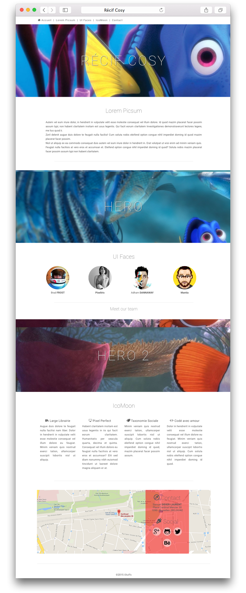
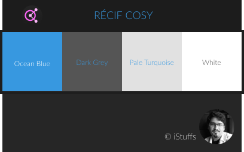

Un design en page unique avec une grande place pour de large photos en arrière plan fixe.

 
**Quelques effets notables**

- Défilement vertical animé sur le clic du menu
- Effet subtile de pied de page qui se révèle au défilement.

## Thème
 
**Dark grey**: #555
**White**: #FFF
**Zircon**: #E1E1E1
**Ocean Blue**: #3798E0

adobe color : [https://color.adobe.com/fr/Océan-cosi-color-theme-6685415/](https://color.adobe.com/fr/Océan-cosi-color-theme-6685415/)

## Police de caractère
 
**Roboto**, moderne sans empâtements, cette police représente les canons actuels de typographie d'interface.

